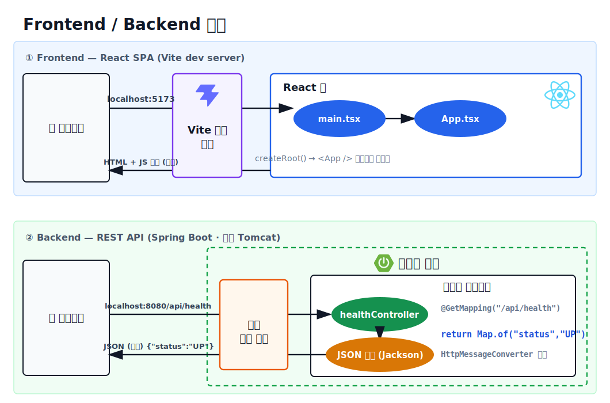

# Ticketing Platform

React, Spring Boot, JPA, MySQL 기반의 티켓 예매 시스템입니다.

좌석 예매 과정에서 발생할 수 있는 동시성 문제를 다루고, 테스트, CI, 보안 스캔, Docker 기반 개발 환경까지 구성하는 것을 목표로 합니다.

Frontend / Backend 구조

> 실제 코드 기준의 요청 흐름도이며, 구조가 바뀌면 [generate-structure.mjs](docs/assets/source/generate-structure.mjs)로 갱신한다.

## 프로젝트 목표

- React와 Spring Boot REST API 연동
- Spring Boot, JPA, MySQL 기반 도메인 설계
- 좌석 예매 동시성 문제 해결
- JUnit, Mockito, Testcontainers 기반 테스트 작성
- GitHub Actions 기반 CI 자동화
- Docker Compose 기반 로컬 개발 환경 구성
- Redis 캐시와 분산락 확장
- Kafka 이벤트 기반 알림 처리 확장
- Swagger/OpenAPI API 문서화
- Jacoco 테스트 커버리지 측정
- 보안 검사와 의존성 업데이트 자동화

## 기술 스택

자세한 기술 스택은 [기술 스택 문서](stack.md)에서 관리합니다.

## 주요 기능

### 회원

- 회원가입
- 로그인
- JWT 인증
- 내 정보 조회

### 공연/이벤트

- 공연 등록
- 공연 목록 조회
- 공연 상세 조회
- 공연 검색
- 페이징

### 좌석

- 공연별 좌석 조회
- 좌석 상태 관리
- AVAILABLE / RESERVED / SOLD_OUT

### 예매

- 좌석 예매
- 예매 취소
- 내 예매 목록 조회
- 동시 예매 방지

### 결제

- 결제 대기 상태 생성
- 결제 완료 처리
- 결제 실패 처리

### 알림

- 예약 완료 이벤트 발행
- Kafka 기반 알림 처리
- 비동기 알림 처리

## Project Status

- [x] Milestone 1 프로젝트 초기화
- [x] Milestone 2 Backend 기초
- [ ] Milestone 3 Frontend 기초
- [ ] Milestone 4 로컬 개발 환경과 JPA
- [ ] Milestone 5 회원과 인증
- [ ] Milestone 6 공연과 좌석
- [ ] Milestone 7 Frontend 화면 연동
- [ ] Milestone 8 예매와 결제
- [ ] Milestone 9 테스트 심화
- [ ] Milestone 10 CI 실습 확장
- [ ] Milestone 11 동시성
- [ ] Milestone 12 Redis 확장
- [ ] Milestone 13 Kafka와 비동기 알림
- [ ] Milestone 14 보안과 품질 자동화
- [ ] Milestone 15 문서화
- [ ] Milestone 16 배포와 최종 점검

## 문서

- [에이전트 작업 규칙](AGENTS.md)
- [기술 스택](stack.md)
- [실행 방법](run.md)
- [로드맵 인덱스](docs/roadmap.md)
- [로드맵 상세 디렉토리](docs/roadmap/)
- [최종 디렉토리 구조](docs/project-structure.md)

## 실행 방법

자세한 실행 방법은 [실행 방법 문서](run.md)에서 관리합니다.
