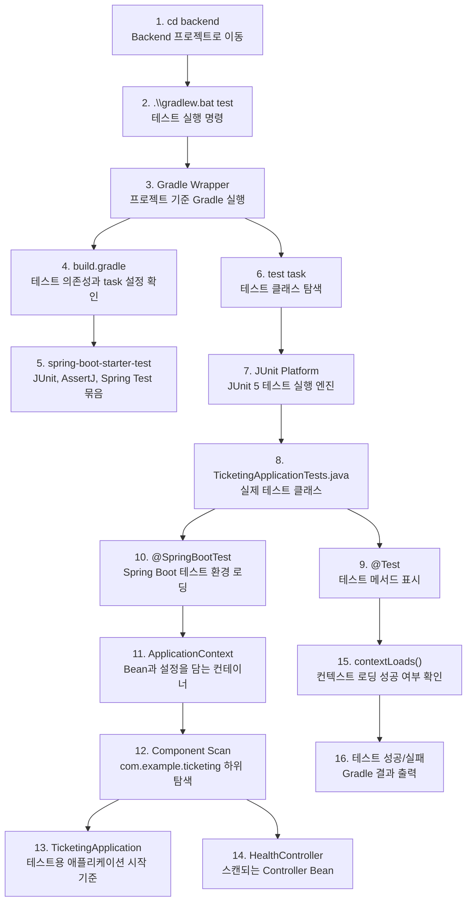

# Issue #4. Backend JUnit 기초 테스트 작성

이 문서는 Issue #4를 진행하면서 Backend 테스트 실행 흐름과 Spring Boot 기본 테스트를 이해하기 위한 학습 노트다.

## 0. Gradle, JUnit, Spring Boot Test 동작 그림



그림은 `1 -> 16` 순서로 읽으면 된다. `backend` 디렉토리에서 `.\gradlew.bat test`를 실행하면 Gradle이 `build.gradle`의 테스트 설정과 의존성을 읽는다. `spring-boot-starter-test`에 포함된 JUnit 5가 `TicketingApplicationTests`를 실행하고, `@SpringBootTest`가 Spring Boot `ApplicationContext`를 로딩한다. `contextLoads()`가 실패하지 않으면 현재 Backend 기본 설정이 테스트 환경에서도 정상이라는 뜻이다.

1. `cd backend`: Gradle Wrapper와 `build.gradle`이 있는 Backend 디렉토리로 이동한다.
2. `.\gradlew.bat test`: Windows에서 Backend 테스트를 실행하는 명령이다.
3. `Gradle Wrapper`: PC에 설치된 Gradle 버전에 덜 의존하고 프로젝트 기준으로 Gradle을 실행한다.
4. `build.gradle`: 테스트에 필요한 의존성과 `test` task 설정을 확인하는 파일이다.
5. `spring-boot-starter-test`: JUnit 5, Spring Test, AssertJ 등 테스트 도구를 묶은 의존성이다.
6. `test task`: Gradle이 테스트 클래스를 찾고 실행하는 작업이다.
7. `JUnit Platform`: JUnit 5 테스트를 실제로 실행하는 기반이다.
8. `TicketingApplicationTests.java`: 이번 이슈에서 확인하는 기본 테스트 클래스다.
9. `@Test`: 해당 메서드를 테스트 메서드로 표시한다.
10. `@SpringBootTest`: Spring Boot 애플리케이션 테스트 환경을 통째로 로딩한다.
11. `ApplicationContext`: Spring Bean과 설정이 올라가는 컨테이너다.
12. `Component Scan`: `com.example.ticketing` 아래의 컴포넌트를 자동으로 찾는다.
13. `TicketingApplication`: 테스트에서 Spring Boot 앱을 시작할 기준 클래스다.
14. `HealthController`: Component Scan으로 등록되는 Controller Bean 예시다.
15. `contextLoads()`: 컨텍스트가 문제 없이 뜨는지 확인하는 smoke test다.
16. `테스트 성공/실패`: Gradle이 최종 테스트 결과를 터미널에 출력한다.

## 목적

Backend에서 JUnit 테스트를 실행하는 흐름을 익힌다.

이번 이슈의 핵심은 기능 구현보다 다음 두 가지를 확인하는 것이다.

- Gradle로 Backend 테스트를 실행할 수 있다.
- Spring Boot 애플리케이션 컨텍스트가 정상적으로 로딩된다.

## 작업 범위

이번 이슈에서 하는 일:

- 기존 기본 테스트 구조 확인
- JUnit 5 테스트 실행 흐름 이해
- `@SpringBootTest`와 `contextLoads()` 의미 이해
- 필요하면 `GET /api/health`를 확인하는 MockMvc 테스트 추가
- 로컬에서 `.\gradlew.bat test` 실행 확인
- 테스트 실행 방법 기록

이번 이슈에서 하지 않는 일:

- GitHub Actions CI 설정
- Linux runner 테스트 자동화
- JPA 테스트
- MySQL 연결 테스트
- Spring Security 테스트
- 회원가입 / 로그인 테스트
- 예매 도메인 테스트

## 현재 테스트 파일

파일 위치:

```text
backend/src/test/java/com/example/ticketing/TicketingApplicationTests.java
```

현재 코드:

```java
package com.example.ticketing;

import org.junit.jupiter.api.Test;
import org.springframework.boot.test.context.SpringBootTest;

@SpringBootTest
class TicketingApplicationTests {

    @Test
    void contextLoads() {
    }

}
```

## package 구조

테스트 클래스의 패키지는 다음과 같다.

```java
package com.example.ticketing;
```

메인 애플리케이션 클래스도 같은 패키지에 있다.

```text
backend/src/main/java/com/example/ticketing/TicketingApplication.java
```

HealthController는 하위 패키지에 있다.

```text
backend/src/main/java/com/example/ticketing/global/common/HealthController.java
```

```java
package com.example.ticketing.global.common;
```

Spring Boot는 메인 클래스가 있는 `com.example.ticketing` 패키지를 기준으로 하위 패키지를 스캔한다.

따라서 `com.example.ticketing.global.common`에 있는 `HealthController`는 자동으로 스캔 대상에 포함된다.

## JUnit 5

JUnit은 Java 테스트 코드를 실행하기 위한 테스트 프레임워크다.

현재 테스트에서 사용하는 어노테이션:

```java
@Test
```

이 어노테이션이 붙은 메서드는 테스트 메서드로 실행된다.

예:

```java
@Test
void contextLoads() {
}
```

메서드 안이 비어 있어도 테스트가 의미 없는 것은 아니다.

`@SpringBootTest`가 붙어 있기 때문에 테스트 실행 전에 Spring Boot 애플리케이션 컨텍스트를 로딩한다.

컨텍스트 로딩 중 문제가 생기면 테스트가 실패한다.

## @SpringBootTest

`@SpringBootTest`는 Spring Boot 테스트 환경을 로딩하는 어노테이션이다.

```java
@SpringBootTest
class TicketingApplicationTests {
}
```

이 어노테이션이 있으면 테스트 실행 시 Spring Boot가 다음을 확인한다.

```text
1. 애플리케이션 설정을 읽을 수 있는가
2. Bean을 생성할 수 있는가
3. Component Scan 범위가 올바른가
4. Controller, Service, Configuration 등이 충돌 없이 등록되는가
```

현재 단계에서는 아직 JPA, Security, MySQL 설정이 없기 때문에 비교적 단순하게 실행된다.

## contextLoads()

`contextLoads()`는 Spring Boot 기본 테스트에서 자주 생성되는 테스트다.

```java
@Test
void contextLoads() {
}
```

이 테스트의 의미:

```text
Spring Boot 애플리케이션 컨텍스트가 정상적으로 뜨는지 확인한다.
```

즉, 서버를 실제로 실행해서 API를 호출하는 테스트는 아니다.

하지만 다음 문제를 조기에 발견할 수 있다.

- Bean 생성 실패
- 잘못된 설정 파일
- Component Scan 문제
- 의존성 충돌
- 애플리케이션 시작 과정 오류

## smoke test 의미

Smoke test는 전체 기능을 깊게 검증하는 테스트가 아니라, 가장 기본적인 실행 가능 여부를 확인하는 테스트다.

현재 `contextLoads()`는 다음 의미의 smoke test로 볼 수 있다.

```text
Backend 애플리케이션이 테스트 환경에서 최소한 시작 가능한가?
```

주의할 점:

```text
자동으로 smoke test가 도는 것은 아니다.
```

현재는 GitHub Actions나 Linux CI가 없기 때문에 테스트는 로컬에서 직접 실행해야 한다.

Windows 로컬 실행:

```powershell
cd backend
.\gradlew.bat test
```

Linux 또는 GitHub Actions에서 실행할 명령은 이후 Issue #5에서 다룬다.

```bash
cd backend
./gradlew test
```

## MockMvc 테스트

`contextLoads()`는 애플리케이션 컨텍스트 로딩만 확인한다.

`GET /api/health`가 실제로 다음 응답을 반환하는지 확인하려면 MockMvc 테스트를 추가할 수 있다.

기대 응답:

```json
{
  "status": "UP"
}
```

MockMvc는 실제 서버 포트를 열지 않고 Spring MVC 요청과 응답을 테스트할 수 있게 해준다.

예상 테스트 방향:

```java
@Autowired
MockMvc mockMvc;

@Test
void healthReturnsUp() throws Exception {
    mockMvc.perform(get("/api/health"))
        .andExpect(status().isOk())
        .andExpect(jsonPath("$.status").value("UP"));
}
```

이 코드는 학습용 방향 예시다.

실제로 추가할 때는 필요한 import와 테스트 설정을 함께 맞춰야 한다.

## static import

MockMvc 테스트 예시에서는 다음과 같은 `static import`를 사용할 수 있다.

```java
import static org.springframework.test.web.servlet.request.MockMvcRequestBuilders.get;
import static org.springframework.test.web.servlet.result.MockMvcResultMatchers.jsonPath;
import static org.springframework.test.web.servlet.result.MockMvcResultMatchers.status;
```

`get()`, `status()`, `jsonPath()`는 객체의 메서드가 아니라 클래스에 붙어 있는 `static` 메서드다.

원래는 클래스 이름을 붙여서 호출한다.

```java
mockMvc.perform(MockMvcRequestBuilders.get("/api/health"))
    .andExpect(MockMvcResultMatchers.status().isOk())
    .andExpect(MockMvcResultMatchers.jsonPath("$.status").value("UP"));
```

일반 import를 사용하면 클래스 이름까지만 줄일 수 있다.

```java
import org.springframework.test.web.servlet.request.MockMvcRequestBuilders;
import org.springframework.test.web.servlet.result.MockMvcResultMatchers;
```

이 경우 코드에서는 여전히 클래스 이름을 붙여야 한다.

```java
mockMvc.perform(MockMvcRequestBuilders.get("/api/health"))
    .andExpect(MockMvcResultMatchers.status().isOk())
    .andExpect(MockMvcResultMatchers.jsonPath("$.status").value("UP"));
```

반면 `static import`를 사용하면 클래스 이름 없이 메서드 이름만 바로 쓸 수 있다.

```java
mockMvc.perform(get("/api/health"))
    .andExpect(status().isOk())
    .andExpect(jsonPath("$.status").value("UP"));
```

정리:

```text
일반 import
-> 클래스 이름을 줄여준다.
-> MockMvcRequestBuilders.get(...)처럼 호출한다.

static import
-> static 메서드 이름을 바로 쓸 수 있게 해준다.
-> get(...)처럼 호출한다.
```

테스트 코드에서는 `assertThat()`, `get()`, `status()`, `jsonPath()`처럼 문장처럼 읽히게 만들기 위해 `static import`를 자주 사용한다.

처음 학습할 때는 일반 import 방식으로 길게 써도 괜찮다.

어떤 클래스에서 온 메서드인지 더 잘 보이기 때문이다.

## javax와 jakarta

예전 Java 웹 표준에서는 `javax.*` 패키지를 사용했다.

예:

```java
import javax.servlet.http.HttpServlet;
import javax.servlet.http.HttpServletRequest;
import javax.servlet.http.HttpServletResponse;
```

Java EE가 Eclipse Foundation으로 넘어가면서 이름이 Jakarta EE로 바뀌었다.

Jakarta EE 9부터는 패키지 이름도 `jakarta.*`로 바뀌었다.

예:

```java
import jakarta.servlet.http.HttpServlet;
import jakarta.servlet.http.HttpServletRequest;
import jakarta.servlet.http.HttpServletResponse;
```

정리:

```text
Java EE 8까지
-> javax.*

Jakarta EE 9부터
-> jakarta.*
```

## Jakarta Servlet

Jakarta Servlet은 예전 Java Servlet의 최신 이름이라고 보면 된다.

예전 이름:

```text
Java Servlet
javax.servlet.*
```

현재 이름:

```text
Jakarta Servlet
jakarta.servlet.*
```

Servlet의 기본 역할은 같다.

```text
HTTP 요청을 받고
요청 데이터를 읽고
응답을 만들어 반환한다.
```

즉 `javax.servlet`과 `jakarta.servlet`은 개념이 완전히 다른 기술이라기보다, Java EE에서 Jakarta EE로 넘어가며 패키지명이 바뀐 것이다.

주의할 점은 둘을 섞어 쓰면 안 된다는 것이다.

예:

```text
Spring Boot 2.x
-> javax 기반

Spring Boot 3.x 이상
-> jakarta 기반
```

현재 프로젝트는 Spring Boot 4.x 기반이므로 `jakarta.*` 계열로 이해하는 것이 맞다.

## Gradle 테스트 설정

파일 위치:

```text
backend/build.gradle
```

현재 테스트 관련 의존성:

```gradle
testImplementation 'org.springframework.boot:spring-boot-starter-webmvc-test'
testRuntimeOnly 'org.junit.platform:junit-platform-launcher'
```

현재 테스트 실행 설정:

```gradle
tasks.named('test') {
    useJUnitPlatform()
}
```

`useJUnitPlatform()`은 Gradle이 JUnit 5 기반 테스트를 실행하도록 설정한다.

## 로컬 테스트 실행

프로젝트 루트에서 backend 디렉토리로 이동한다.

```powershell
cd backend
```

테스트를 실행한다.

```powershell
.\gradlew.bat test
```

정상적으로 끝나면 `BUILD SUCCESSFUL`이 출력된다.

테스트 리포트는 보통 다음 위치에 생성된다.

```text
backend/build/reports/tests/test/index.html
```

## VS Code 테스트 실행 버튼

VS Code에서 테스트 옆의 실행 버튼을 누르면 테스트가 실행된다.

다만 이 실행은 항상 Gradle의 `test` 작업과 같은 것은 아니다.

VS Code 화면에 다음처럼 표시되면 Java 확장의 Test Runner for Java가 테스트 결과를 보여주는 것이다.

```text
Test Runner for Java
TicketingApplicationTests
contextLoads()
이전 결과
```

이 방식은 테스트를 빠르게 확인할 때 편하다.

하지만 Gradle HTML 리포트 생성을 보장하지 않는다.

즉, VS Code에서 테스트가 통과해도 다음 파일이 새로 생성되거나 갱신되지 않을 수 있다.

```text
backend/build/reports/tests/test/index.html
```

테스트 리포트 파일까지 확인하려면 터미널에서 Gradle 테스트를 직접 실행한다.

```powershell
cd backend
.\gradlew.bat test
```

정리:

```text
VS Code 실행 버튼
-> Test Runner for Java에서 결과 확인
-> Gradle HTML 리포트 생성은 보장하지 않음

.\gradlew.bat test
-> Gradle test 작업 실행
-> backend/build/reports/tests/test/index.html 생성 또는 갱신
```

## Windows와 Linux 명령 차이

Windows PowerShell:

```powershell
.\gradlew.bat test
```

macOS/Linux/GitHub Actions:

```bash
./gradlew test
```

이번 Issue #4에서는 Windows 로컬 실행을 먼저 확인한다.

Linux runner에서 자동 실행하는 설정은 Issue #5에서 진행한다.

## Issue #4와 Issue #5의 차이

Issue #4:

```text
내 컴퓨터에서 Backend 테스트가 실행되는지 확인한다.
```

주요 명령:

```powershell
.\gradlew.bat test
```

Issue #5:

```text
GitHub Actions에서 Backend 테스트가 자동으로 실행되게 만든다.
```

주요 파일:

```text
.github/workflows/backend-ci.yml
```

주요 명령:

```bash
./gradlew test
```

## 진행 TODO

1. Issue #4 브랜치를 만든다.

```powershell
git switch -c issue/4-backend-smoke-test
```

2. 현재 테스트 파일을 확인한다.

```text
backend/src/test/java/com/example/ticketing/TicketingApplicationTests.java
```

3. `contextLoads()`가 어떤 의미인지 이해한다.

4. 선택해서 진행한다.

```text
방법 A: contextLoads()만 유지하고 테스트 실행 흐름을 학습한다.
방법 B: MockMvc로 GET /api/health 테스트를 추가한다.
```

5. 테스트를 실행한다.

```powershell
cd backend
.\gradlew.bat test
```

6. 테스트 성공 여부를 확인한다.

```text
BUILD SUCCESSFUL
```

7. 변경사항을 확인한다.

```powershell
git status --short
git diff
```

8. 커밋한다.

```powershell
git add .
git commit -m "test: add backend smoke test"
```

## 완료 조건

- 테스트가 1개 이상 통과한다.
- `.\gradlew.bat test` 실행 방법이 기록되어 있다.
- `contextLoads()` 또는 MockMvc 테스트의 목적을 설명할 수 있다.
- Issue #5에서 CI로 넘어가기 전에 로컬 테스트 흐름을 이해한다.

## 추천 커밋 메시지

```bash
test: add backend smoke test
```
