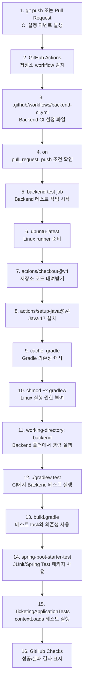

# Issue #5. Backend CI 첫 실습

이 문서는 Issue #5를 진행하면서 GitHub Actions로 Backend 테스트를 자동 실행하는 흐름을 이해하기 위한 학습 노트다.

## 0. GitHub Actions Backend CI 동작 그림



그림은 `1 -> 16` 순서로 읽으면 된다. 브랜치에 push하거나 PR을 만들면 GitHub Actions가 `.github/workflows/backend-ci.yml`을 읽는다. workflow는 Ubuntu runner를 준비하고, `actions/checkout`으로 코드를 받고, `actions/setup-java`로 Java 17을 설치한 뒤 `backend` 디렉토리에서 `./gradlew test`를 실행한다. 로컬에서 수동으로 하던 Backend 테스트를 GitHub가 대신 실행하고 Checks 화면에 결과를 남기는 흐름이다.

1. `git push 또는 Pull Request`: GitHub Actions가 시작되는 트리거다.
2. `GitHub Actions`: GitHub에서 workflow를 실행해 주는 자동화 기능이다.
3. `.github/workflows/backend-ci.yml`: Backend CI 작업을 정의하는 YAML 파일이다.
4. `on`: 어떤 이벤트에서 CI를 실행할지 정하는 영역이다.
5. `backend-test job`: Backend 테스트를 실행하는 하나의 작업 단위다.
6. `ubuntu-latest`: GitHub가 제공하는 Linux 실행 환경이다.
7. `actions/checkout@v4`: CI runner에 저장소 코드를 내려받는 공식 action이다.
8. `actions/setup-java@v4`: CI runner에 Java를 설치하는 공식 action이다.
9. `cache: gradle`: Gradle 의존성 다운로드 시간을 줄이는 캐시 설정이다.
10. `chmod +x gradlew`: Linux에서 Gradle Wrapper를 실행할 수 있게 권한을 준다.
11. `working-directory: backend`: 명령을 `backend/` 폴더 기준으로 실행하게 한다.
12. `./gradlew test`: CI에서 실행하는 Backend 테스트 명령이다.
13. `build.gradle`: Gradle이 테스트 task와 의존성 정보를 읽는 파일이다.
14. `spring-boot-starter-test`: JUnit과 Spring Test를 제공하는 테스트 패키지 묶음이다.
15. `TicketingApplicationTests`: CI에서 실제로 실행되는 기본 Spring Boot 테스트다.
16. `GitHub Checks`: PR 또는 commit 화면에서 CI 성공/실패를 보여주는 결과 화면이다.

## 목적

GitHub Actions workflow를 만들어서 Pull Request 또는 push 시 Backend 테스트가 자동으로 실행되게 한다.

지금까지는 로컬에서 직접 다음 명령을 실행해서 테스트를 확인했다.

```powershell
cd backend
.\gradlew.bat test
```

이번 이슈에서는 GitHub가 같은 테스트를 자동으로 실행하도록 만든다.

## 완료 조건

- `.github/workflows/backend-ci.yml` 파일이 있다.
- GitHub Actions에서 Backend CI가 실행된다.
- CI 안에서 `./gradlew test`가 성공한다.

## 작업 범위

이번 이슈에서 하는 일:

- GitHub Actions workflow 파일 생성
- Pull Request와 push 이벤트 설정
- Ubuntu runner에서 Java 17 설정
- Gradle cache 설정
- `backend` 디렉토리에서 `./gradlew test` 실행

이번 이슈에서 하지 않는 일:

- Frontend CI 설정
- Docker Compose CI 설정
- Security scan 설정
- Jacoco coverage 설정
- 배포 자동화
- `./gradlew build`까지 강제 실행

## 새로 만들 파일

파일 위치:

```text
.github/workflows/backend-ci.yml
```

## 권장 workflow 내용

```yaml
name: Backend CI

on:
  pull_request:
    branches:
      - main
  push:
    branches:
      - main
      - "issue/**"

jobs:
  backend-test:
    runs-on: ubuntu-latest

    steps:
      - name: Checkout source code
        uses: actions/checkout@v4

      - name: Set up Java 17
        uses: actions/setup-java@v4
        with:
          distribution: temurin
          java-version: 17
          cache: gradle

      - name: Grant execute permission for Gradle wrapper
        run: chmod +x gradlew
        working-directory: backend

      - name: Run backend tests
        run: ./gradlew test
        working-directory: backend
```

## workflow 구성 설명

### name

```yaml
name: Backend CI
```

GitHub Actions 화면에 표시될 workflow 이름이다.

### on

```yaml
on:
  pull_request:
    branches:
      - main
  push:
    branches:
      - main
      - "issue/**"
```

다음 상황에서 CI를 실행한다.

- `main` 브랜치로 Pull Request를 만들 때
- `main` 브랜치에 push할 때
- `issue/`로 시작하는 브랜치에 push할 때

### runs-on

```yaml
runs-on: ubuntu-latest
```

GitHub가 제공하는 Ubuntu 환경에서 workflow를 실행한다.

### checkout

```yaml
uses: actions/checkout@v4
```

CI 서버에 현재 저장소 코드를 내려받는다.

### setup-java

```yaml
uses: actions/setup-java@v4
with:
  distribution: temurin
  java-version: 17
  cache: gradle
```

Java 17을 설치하고 Gradle cache를 활성화한다.

이 프로젝트는 Backend가 Java 17 기준이므로 CI에서도 Java 17을 사용한다.

### chmod

```yaml
run: chmod +x gradlew
working-directory: backend
```

GitHub Actions는 Linux 환경에서 실행되므로 `gradlew` 파일에 실행 권한이 필요할 수 있다.

Windows에서는 `gradlew.bat`을 사용하지만, CI에서는 Linux runner 기준으로 `gradlew`를 사용한다.

### test

```yaml
run: ./gradlew test
working-directory: backend
```

`backend` 디렉토리에서 Gradle 테스트를 실행한다.

이번 이슈의 핵심 완료 조건이다.

## 직접 진행 순서

Issue #4가 `main`에 반영된 뒤 시작한다.

```powershell
git switch main
git pull
git switch -c issue/5-backend-ci
```

workflow 디렉토리를 만든다.

```powershell
mkdir .github\workflows
```

다음 파일을 작성한다.

```text
.github/workflows/backend-ci.yml
```

로컬에서 Backend 테스트가 통과하는지 먼저 확인한다.

```powershell
cd backend
.\gradlew.bat test
```

## Git 확인

변경 파일을 확인한다.

```powershell
git status --short
```

주의할 점:

```text
.github/modernize/
```

같은 다른 untracked 파일이 보이면 같이 커밋하지 않는다.

이번 이슈에서는 workflow 파일 하나만 추가한다.

```powershell
git add .github/workflows/backend-ci.yml
git status --short
```

정상 예시:

```text
A  .github/workflows/backend-ci.yml
```

## 커밋

```powershell
git commit -m "ci: add initial backend ci workflow"
```

## Push와 PR 확인

```powershell
git push -u origin issue/5-backend-ci
```

GitHub에서 Pull Request를 만든 뒤 다음을 확인한다.

- PR 화면의 Checks 탭
- GitHub Actions 탭
- `Backend CI` workflow 성공 여부

## 추천 커밋 메시지

```bash
ci: add initial backend ci workflow
```
