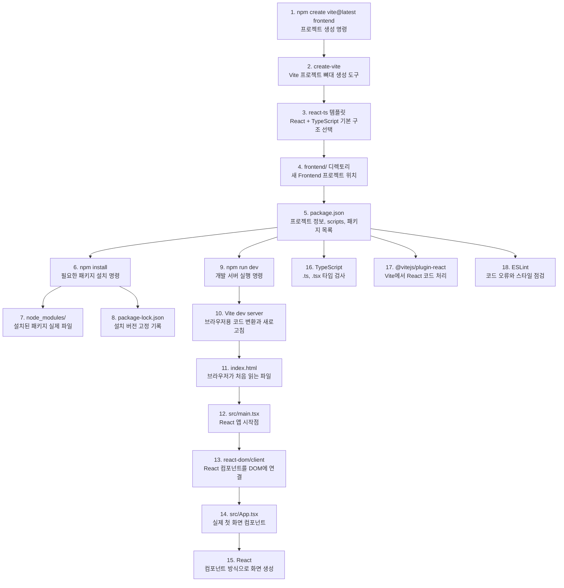

# Issue #6. React Frontend 생성

이 문서는 Issue #6을 진행하면서 만들 React Frontend 기본 구조와 실행 흐름을 이해하기 위한 학습 노트다.

Milestone 3 (Frontend 기초)의 첫 번째 이슈이며, 이번 이슈에서 처음으로 `frontend/` 디렉토리를 생성한다.

## 0. Vite, React, TypeScript 생성/실행 그림



그림은 `1 -> 18` 순서로 읽으면 된다. `npm create vite@latest frontend -- --template react-ts`를 실행하면 `create-vite`가 `frontend/` 폴더에 React + TypeScript 프로젝트 뼈대를 만든다. 그 다음 `npm install`로 `package.json`에 적힌 패키지를 설치하고, `npm run dev`로 Vite 개발 서버를 켠다. 브라우저는 `index.html`을 읽고, `main.tsx`가 `App.tsx`를 `#root`에 렌더링하면서 첫 화면이 열린다.

1. `npm create vite@latest frontend`: `frontend/` 프로젝트를 새로 만드는 시작 명령이다.
2. `create-vite`: Vite가 제공하는 프로젝트 생성 도구다. Spring Initializr처럼 기본 뼈대를 만들어 준다.
3. `--template react-ts`: React와 TypeScript를 함께 쓰는 템플릿을 선택한다.
4. `frontend/`: 이번 이슈에서 새로 생기는 Frontend 루트 디렉토리다.
5. `package.json`: npm scripts와 사용할 패키지 이름을 기록하는 중심 파일이다.
6. `npm install`: `package.json`을 보고 실제 패키지를 내려받는다.
7. `node_modules/`: 내려받은 패키지가 저장되는 폴더다. 직접 수정하거나 커밋하지 않는다.
8. `package-lock.json`: 설치된 패키지의 정확한 버전을 잠그는 자동 생성 파일이다.
9. `npm run dev`: `package.json`의 `dev` script를 실행한다.
10. `Vite dev server`: 코드를 브라우저가 읽을 수 있게 변환하고, 수정 사항을 빠르게 반영한다.
11. `index.html`: 브라우저가 처음 여는 HTML이며, React가 들어갈 `#root`가 있다.
12. `src/main.tsx`: React 앱을 시작하고 `App` 컴포넌트를 연결하는 파일이다.
13. `react-dom/client`: React 컴포넌트를 실제 브라우저 DOM에 붙이는 패키지다.
14. `src/App.tsx`: 첫 화면을 담당하는 최상위 React 컴포넌트다.
15. `react`: 컴포넌트 방식으로 화면을 만들 때 사용하는 핵심 패키지다.
16. `typescript`: `.ts`, `.tsx` 코드의 타입을 검사해 실수를 줄인다.
17. `@vitejs/plugin-react`: Vite가 React 문법과 빠른 새로고침을 처리하게 해 주는 패키지다.
18. `eslint`: 코드 문제를 미리 찾기 위한 린터다. 세부 정리는 Issue #7에서 이어간다.

## 목적

Vite + React + TypeScript 기반의 Frontend 기본 프로젝트를 생성하고, 최소 실행 가능한 화면을 띄운다.

이번 이슈의 핵심은 기능 구현이 아니라 다음 한 가지를 확인하는 것이다.

- `npm run dev` 실행 시 브라우저에서 화면이 열린다.

Backend가 Issue #3에서 `GET /api/health`로 "서버가 실행된다"를 확인한 것처럼, Frontend는 이번 이슈에서 "개발 서버가 실행되고 화면이 뜬다"를 확인한다.

## 필요성

지금까지는 Backend만 있었다. 사용자가 직접 보는 화면을 만들려면 Frontend 프로젝트가 필요하다.

- React: 화면(UI)을 컴포넌트 단위로 만드는 라이브러리
- TypeScript: JavaScript에 타입을 더해 실수를 줄여주는 언어
- Vite: 빠른 개발 서버와 빌드를 제공하는 도구

이후 마일스톤에서 이 Frontend가 Backend REST API(`/api/...`)와 연동된다.

## 학습 개념

이번 이슈에서 익혀야 할 개념이다.

- `npm`과 `package.json`의 역할
- Vite 프로젝트 생성 흐름 (`npm create vite@latest`)
- 개발 서버(`npm run dev`)와 빌드(`npm run build`)의 차이
- React 진입점 구조: `index.html` → `src/main.tsx` → `src/App.tsx`
- `node_modules`와 `package-lock.json`을 직접 만들지 않는 이유

### 용어 메모

- **React**: 화면(UI)을 만드는 JavaScript 라이브러리. 화면을 컴포넌트(부품) 단위로 쪼개 조립한다.
- **TypeScript**: JavaScript + 타입(type). 변수·함수에 타입을 정해두어 실행 전에 실수를 잡아준다.
- **Vite**: 개발 서버 + 빌드 도구. 코드를 브라우저가 이해하는 형태로 빠르게 변환하고 `npm run dev`로 즉시 화면을 띄운다. (프랑스어로 "빠르다")
- **npx 방식**: 패키지를 PC에 영구 설치하지 않고 그때그때 받아서 한 번만 실행하는 방식. `create-vite`처럼 프로젝트 생성 때 한 번만 쓰는 도구에 적합하다. `npm create vite`가 내부적으로 이 방식을 쓴다.
- Backend의 **Spring Initializr(start.spring.io)** 와 Frontend의 **create-vite**는 둘 다 "프로젝트 기본 뼈대(scaffold)를 생성하는 도구"라는 점에서 같은 역할이다. 다만 Spring Initializr는 웹사이트에서 zip을 받고, create-vite는 터미널 명령으로 바로 생성하는 차이가 있다.

## 작업 범위

이번 이슈에서 하는 일:

- Vite로 React + TypeScript 프로젝트 생성
- 프로젝트 루트의 `frontend/` 디렉토리로 배치
- 의존성 설치 (`npm install`)
- 개발 서버 실행 확인 (`npm run dev`)
- 루트 `.gitignore`에 `node_modules` 등이 무시되는지 확인

이번 이슈에서 하지 않는 일:

- Axios로 Backend API 연동 (Issue #7 이후)
- React Router 라우팅 구성
- ESLint / Prettier 세부 설정과 npm scripts 정리 (Issue #7)
- Frontend CI 작성 (Issue #8)
- 회원/공연/좌석 등 실제 화면(page) 구현
- 상태관리(stores), 타입(types) 등 도메인 구조 추가

> 위 항목들은 이후 이슈에서 필요할 때 추가한다. 한 번에 다 넣으면 실행 흐름이 복잡해진다. Backend Issue #3에서 JPA/Security를 미리 넣지 않은 것과 같은 원칙이다.

## 사전 준비 (Node.js)

Frontend 개발에는 Node.js가 필요하다. LTS 버전을 권장한다.

확인 명령:

```powershell
node -v
npm -v
```

정상 예시:

```text
v20.x.x
10.x.x
```

`node -v`가 동작하지 않으면 Node.js LTS를 먼저 설치한다.

### 버전 관련 메모

- Node는 짝수 버전(18, 20, 22, 24...)이 LTS(장기 지원) 라인이다. 따라서 `v24.x` 도 정상이며, Vite + React는 Node 18+ 면 문제없이 동작한다. 위 예시의 `v20.x.x`는 "이 정도면 OK"라는 예시 숫자일 뿐, 꼭 20이어야 하는 것은 아니다.
- 호환성은 **버전 숫자**(Node 24, Java 17)로 따진다.
- `HotSpot`은 호환성과 무관하다. Backend JDK 경로(`jdk-17...-hotspot`)에 보이는 그 단어는 **Java를 실행하는 가상머신(JVM)의 이름**이다. 자주 실행되는 부분(hot spot)을 찾아 최적화 컴파일하는 방식이라 붙은 이름이며, Node 버전과는 전혀 별개다.

| 구분 | 무엇 | 우리 버전 |
| --- | --- | --- |
| Backend | Java JDK (HotSpot JVM) | 17 |
| Frontend | Node.js | 24.x (LTS) |

## 디렉토리 배치 원칙

Backend가 `backend/` 바로 아래에 `build.gradle`이 있었던 것처럼, Frontend도 `frontend/` 바로 아래에 `package.json`이 있어야 한다.

정상 구조:

```text
event-ticketing-system/frontend/package.json
event-ticketing-system/frontend/index.html
event-ticketing-system/frontend/vite.config.ts
event-ticketing-system/frontend/src/
```

잘못된 구조:

```text
event-ticketing-system/frontend/ticketing-frontend/package.json
```

`package.json`은 `frontend/` 바로 아래에 있어야 한다.

## 직접 진행 순서 (TODO)

아래 순서대로 직접 진행해 본다. 막히면 그때 도움을 요청한다.

### 1. 브랜치 생성

Issue #5가 `main`에 반영된 상태에서 시작한다.

```powershell
git switch main
git pull
git switch -c issue/6-init-frontend
```

### 2. Vite 프로젝트 생성

프로젝트 루트에서 실행한다.

```powershell
npm create vite@latest frontend -- --template react-ts
```

- `frontend`: 생성할 폴더 이름
- `--template react-ts`: React + TypeScript 템플릿

> `--` 뒤의 옵션은 Vite에게 전달되는 옵션이다. PowerShell에서 그대로 입력하면 된다.

#### 생성 중 나오는 질문

- `Ok to proceed? (y)` → `create-vite` 도구를 npx로 잠깐 받아 실행한다는 확인. `y` 입력.
- `Use ESLint instead of Oxlint?` → **`Yes (ESLint)` 를 선택한다.**
  - 둘 다 코드 오류·스타일을 잡아주는 **린터(Linter)**다.
  - **Oxlint**: Rust로 만들어 매우 빠른 신생 린터. 다만 플러그인·자료가 아직 적다.
  - **ESLint**: 사실상 표준 린터. 자료·예제가 압도적으로 많다.
  - 이 프로젝트는 README 기술 스택에 ESLint가 명시되어 있고, Issue #7에서 lint 스크립트를 직접 구성하므로 자료가 많은 **ESLint**가 학습에 유리하다. (학습용에서는 속도보다 표준·자료가 중요)

### 3. 의존성 설치

```powershell
cd frontend
npm install
```

이 단계에서 `node_modules/`와 `package-lock.json`이 생성된다.

### 4. 개발 서버 실행

```powershell
npm run dev
```

터미널에 다음과 비슷한 주소가 출력된다.

```text
  VITE v5.x.x  ready in 300 ms

  ➜  Local:   http://localhost:5173/
```

브라우저에서 `http://localhost:5173/`을 열어 Vite + React 기본 화면이 보이면 성공이다.

서버를 멈출 때는 터미널에서 `Ctrl + C`.

## 생성된 주요 파일 (확인용)

| 파일 | 설명 |
| --- | --- |
| `package.json` | 프로젝트 정보와 의존성, npm scripts 정의 |
| `package-lock.json` | 설치된 의존성의 정확한 버전 기록 (npm이 자동 생성) |
| `index.html` | 브라우저가 처음 읽는 HTML, React가 여기에 마운트됨 |
| `vite.config.ts` | Vite 설정 파일 |
| `tsconfig.json` | TypeScript 컴파일 설정 |
| `src/main.tsx` | React 앱의 진입점, `App`을 `index.html`에 연결 |
| `src/App.tsx` | 최상위 React 컴포넌트 (첫 화면) |
| `node_modules/` | 설치된 라이브러리 (커밋하지 않음) |

### 진입점 흐름

```text
index.html  →  src/main.tsx  →  src/App.tsx
(빈 div #root)   (root에 App 렌더)   (실제 화면 컴포넌트)
```

`index.html` 안의 `<div id="root"></div>`에 `main.tsx`가 `App` 컴포넌트를 그려 넣는 구조다.

### 실제 생성된 디렉토리 구조

```text
frontend/
├── index.html              # 진입 HTML, <div id="root"> 포함
├── package.json            # 프로젝트 정보 / 의존성 / npm scripts
├── package-lock.json       # 설치된 의존성의 정확한 버전 (자동 생성)
├── vite.config.ts          # Vite 설정
├── eslint.config.js        # ESLint 설정 (생성 시 ESLint 선택)
├── tsconfig.json           # TypeScript 설정 (아래 둘을 묶는 루트)
├── tsconfig.app.json       # 앱 소스(src)용 TS 설정
├── tsconfig.node.json      # Vite 설정 등 Node 환경용 TS 설정
├── .gitignore              # frontend 전용 무시 목록 (node_modules 등)
├── README.md               # Vite 템플릿 기본 안내 (필수 아님)
├── node_modules/           # 설치된 라이브러리 (커밋 안 함)
├── public/                 # 그대로 제공되는 정적 파일
│   ├── favicon.svg
│   └── icons.svg
└── src/                    # 실제 작성하는 소스 코드
    ├── main.tsx            # 진입점, App을 #root에 렌더
    ├── App.tsx             # 최상위 컴포넌트 (첫 화면 / 카운터)
    ├── App.css             # App 컴포넌트 스타일
    ├── index.css           # 전역 스타일
    └── assets/             # 이미지 등 컴포넌트에서 import하는 자원
```

> 최종 목표 구조(`docs/project-structure.md`)의 `api/`, `components/`, `pages/`, `routes/`, `hooks/`, `stores/`, `types/`, `styles/` 등은 아직 없다. 이후 이슈에서 필요할 때 만든다.
>
> `tsconfig`가 3개로 나뉜 이유: 루트 `tsconfig.json`이 앱용(`app`)과 Node용(`node`) 설정을 각각 참조(references)하는 구조다. 앱 코드와 Vite 설정 코드는 실행 환경이 달라 설정을 분리한다.

## npm scripts 확인

`package.json`의 `scripts`를 열어 본다. Vite 템플릿은 보통 다음을 제공한다.

```json
{
  "scripts": {
    "dev": "vite",
    "build": "tsc -b && vite build",
    "preview": "vite preview"
  }
}
```

- `dev`: 개발 서버 실행 (이번 이슈의 완료 조건)
- `build`: 배포용 정적 파일 생성
- `preview`: 빌드 결과를 미리 보기

> `lint` / `test` 스크립트 정리는 Issue #7에서 다룬다. 이번에는 `dev`가 동작하는 것까지만 확인한다.

## 주의할 점

- `node_modules/`는 커밋하지 않는다. 용량이 매우 크고 `npm install`로 언제든 다시 생성된다.
- `package-lock.json`은 직접 작성하거나 수정하지 않는다. `npm install`이 자동으로 갱신한 결과만 커밋한다. (로드맵 진행 원칙과 동일)
- 루트 `.gitignore`에 `node_modules`가 무시되도록 되어 있는지 확인한다. 없다면 추가한다.
- Backend 포트는 `8080`, Frontend 개발 서버 포트는 기본 `5173`이다. 서로 다르므로 충돌하지 않는다.
- Vite 템플릿이 `frontend/` 안에 자체 `.gitignore`를 만든다. 루트 `.gitignore`와 함께 있어도 문제 없다.

## Git 확인

작업 브랜치 예시:

```text
issue/6-init-frontend
```

상태 확인:

```powershell
git status --short --branch
```

커밋에 포함하면 안 되는 대표 항목:

```text
frontend/node_modules/
frontend/dist/
```

커밋 대상 예시:

```text
frontend/package.json
frontend/package-lock.json
frontend/index.html
frontend/vite.config.ts
frontend/tsconfig.json
frontend/src/
```

`git status --short`에서 `node_modules`가 보이면 `.gitignore` 설정이 빠진 것이니 커밋 전에 먼저 처리한다.

## 완료 조건

- `frontend/` 디렉토리가 생성되어 있다.
- `frontend/package.json`이 존재한다.
- `cd frontend; npm run dev` 실행 시 개발 서버가 뜨고 브라우저에서 화면이 열린다.

## Push와 PR

```powershell
git add frontend
git status --short
git commit -m "feat: initialize react frontend"
git push -u origin issue/6-init-frontend
```

GitHub에서 Pull Request를 만든 뒤 확인한다.

- 변경 파일에 `node_modules`가 포함되지 않았는지
- (Issue #8에서 Frontend CI를 추가하면) Checks 탭

## 추천 커밋 메시지

```bash
feat: initialize react frontend
```

## 다음 이슈 예고

- Issue #7. Frontend npm scripts와 테스트 기초 (lint / test / build 흐름 구성)
- Issue #8. Frontend CI 첫 실습 (`.github/workflows/frontend-ci.yml`)
