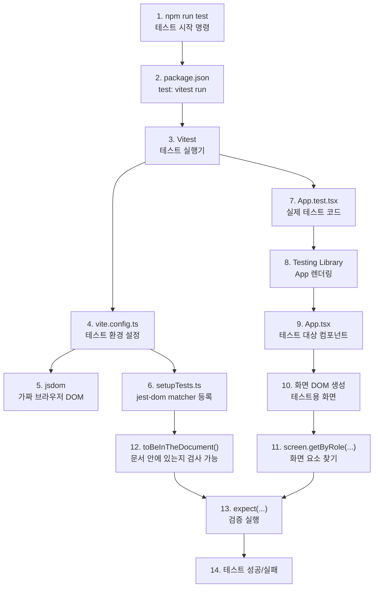

# Issue #7. Frontend npm scripts와 테스트 기초

## 0. React, TypeScript, Vitest 동작 그림



그림은 `1 -> 14` 순서로 읽으면 된다. `npm run test`를 실행하면 `package.json`의 test 스크립트가 `Vitest`를 켜고, Vitest는 `vite.config.ts`를 읽어서 테스트용 브라우저 환경(`jsdom`)과 공통 설정(`setupTests.ts`)을 준비한다. 그 다음 `App.test.tsx`가 `App.tsx`를 테스트용 화면에 렌더링하고, 화면에 원하는 요소가 있는지 검사한다.

1. `React`: `App.tsx` 같은 컴포넌트로 화면을 만든다.
2. `TypeScript`: `.ts`, `.tsx` 코드의 타입과 문법을 검사한다.
3. `Vitest`: `App.test.tsx` 같은 테스트 파일을 실행한다.
4. `jsdom`: 테스트 중 브라우저 DOM을 흉내 낸다.
5. `Testing Library`: React 컴포넌트를 렌더링하고 화면 요소를 찾는다.
6. `jest-dom`: `toBeInTheDocument()` 같은 검증 문법을 추가한다.

## 1. 이슈 요약

1. 이번 이슈는 `frontend/package.json`에 `test` 실행 흐름을 추가하고, React 컴포넌트 테스트 1개를 만들어 `lint`, `test`, `build`가 모두 통과하게 만드는 작업이다.
2. 작업 파일은 `frontend/package.json`, `frontend/package-lock.json`, `frontend/vite.config.ts`, `frontend/src/setupTests.ts`, `frontend/src/App.test.tsx`다.
3. 완료 기준은 아래 명령 3개가 모두 성공하는 것이다.

```powershell
cd frontend
npm run lint
npm run test
npm run build
```

4. 추천 브랜치는 `issue/7-frontend-test-scripts`다.
5. 추천 커밋 메시지는 `test: add frontend test script`다.
6. `.github/workflows/frontend-ci.yml`은 Issue #8에서 만들 파일이므로 이번 이슈에서는 만들지 않는다.

## 2. 브랜치 만들기

1. 프로젝트 루트로 이동한다.

```powershell
cd E:\event-ticketing-system
```

2. 현재 상태를 확인한다.

```powershell
git status --short --branch
```

3. `main`으로 이동한다.

```powershell
git switch main
```

4. 원격 변경을 가져온다.

```powershell
git pull
```

5. Issue #7 브랜치를 만든다.

```powershell
git switch -c issue/7-frontend-test-scripts
```

## 3. 테스트 패키지 설치

1. Frontend 디렉토리로 이동한다.

```powershell
cd frontend
```

2. Vitest와 Testing Library를 설치한다.

```powershell
npm install -D vitest jsdom @testing-library/react @testing-library/jest-dom @testing-library/user-event
```

3. 설치 후 변경 파일을 확인한다.

```powershell
git status --short
```

4. 이 단계에서는 보통 아래 2개 파일이 변경된다.

```text
frontend/package.json
frontend/package-lock.json
```

## 4. package.json 수정

1. `frontend/package.json`의 `scripts`에 `test`, `test:watch`를 추가한다.

```json
{
  "scripts": {
    "dev": "vite",
    "build": "tsc -b && vite build",
    "lint": "eslint .",
    "test": "vitest run",
    "test:watch": "vitest",
    "preview": "vite preview"
  }
}
```

2. `npm run test`는 한 번 실행하고 종료되는 명령이다.
3. `npm run test:watch`는 개발 중 파일 변경을 감시하면서 테스트를 반복 실행하는 명령이다.
4. Issue #8의 Frontend CI에서는 `npm run test`를 사용한다.

## 5. vite.config.ts 수정

1. `frontend/vite.config.ts`를 아래처럼 수정한다.

```ts
import { defineConfig } from 'vitest/config'
import react from '@vitejs/plugin-react'

// https://vite.dev/config/
export default defineConfig({
  plugins: [react()],
  test: {
    environment: 'jsdom',
    setupFiles: './src/setupTests.ts',
  },
})
```

2. `defineConfig`를 `vite`가 아니라 `vitest/config`에서 가져오는 이유는 `test` 설정 타입을 인식시키기 위해서다.
3. `environment: 'jsdom'`은 React 컴포넌트 테스트에서 DOM을 사용할 수 있게 한다.
4. `setupFiles`는 테스트 실행 전에 `setupTests.ts`를 먼저 불러온다.

## 6. setupTests.ts 생성

1. 아래 파일을 새로 만든다.

```text
frontend/src/setupTests.ts
```

2. 파일 내용은 아래처럼 작성한다.

```ts
import '@testing-library/jest-dom/vitest'
```

3. 이 설정으로 `toBeInTheDocument()` 같은 matcher를 Vitest에서 사용할 수 있다.

## 7. App.test.tsx 생성

1. 아래 파일을 새로 만든다.

```text
frontend/src/App.test.tsx
```

2. 현재 `App.tsx` 화면에 맞춰 최소 렌더링 테스트를 작성한다.

```tsx
import { render, screen } from '@testing-library/react'
import { describe, expect, it } from 'vitest'
import App from './App'

describe('App', () => {
  it('renders the starter screen', () => {
    render(<App />)

    expect(screen.getByRole('heading', { name: /get started/i })).toBeInTheDocument()
    expect(screen.getByRole('button', { name: /count is 0/i })).toBeInTheDocument()
  })
})
```

3. 이 테스트는 현재 화면의 제목과 카운터 버튼이 렌더링되는지만 확인한다.
4. 나중에 `App.tsx`의 문구를 바꾸면 테스트의 `get started`, `count is 0`도 같이 바꾸면 된다.

## 8. lint 확인

1. Frontend 디렉토리에서 lint를 실행한다.

```powershell
npm run lint
```

2. 실패하면 출력된 파일명과 줄 번호를 보고 수정한다.
3. 이 단계에서 통과해야 다음 `test`, `build` 확인으로 넘어간다.

## 9. test 확인

1. 테스트를 실행한다.

```powershell
npm run test
```

2. 성공하면 `App.test.tsx` 테스트가 통과해야 한다.
3. `document is not defined`가 나오면 `vite.config.ts`의 `environment: 'jsdom'` 설정을 확인한다.
4. `toBeInTheDocument is not a function`이 나오면 `setupTests.ts` import와 `setupFiles` 경로를 확인한다.

## 10. build 확인

1. 빌드를 실행한다.

```powershell
npm run build
```

2. 이 명령은 `tsc -b`와 `vite build`를 함께 실행한다.
3. 성공하면 `frontend/dist/`가 생성될 수 있다.
4. `dist/`는 빌드 결과물이므로 커밋하지 않는다.

## 11. 변경 파일 확인

1. 프로젝트 루트로 돌아간다.

```powershell
cd ..
```

2. 변경 상태를 확인한다.

```powershell
git status --short
```

3. 이번 이슈의 커밋 대상은 아래 파일이다.

```text
frontend/package.json
frontend/package-lock.json
frontend/vite.config.ts
frontend/src/setupTests.ts
frontend/src/App.test.tsx
```

4. `frontend/node_modules/`, `frontend/dist/`, `.github/workflows/frontend-ci.yml`은 커밋 대상이 아니다.

## 12. diff 확인

1. 변경 내용을 확인한다.

```powershell
git diff
```

2. `package-lock.json`은 길어도 npm이 자동으로 바꾼 결과인지 확인만 한다.
3. 직접 작성한 `vite.config.ts`, `setupTests.ts`, `App.test.tsx`는 오타가 없는지 확인한다.

## 13. 스테이징

1. Issue #7 파일만 스테이징한다.

```powershell
git add frontend/package.json frontend/package-lock.json frontend/vite.config.ts frontend/src/setupTests.ts frontend/src/App.test.tsx
```

2. 스테이징 결과를 확인한다.

```powershell
git status --short
```

3. 위 5개 파일만 `A` 또는 `M`으로 올라가 있는지 확인한다.

## 14. 커밋 전 최종 확인

1. 커밋 전에 다시 한 번 3개 명령을 실행한다.

```powershell
cd frontend
npm run lint
npm run test
npm run build
cd ..
```

2. 셋 중 하나라도 실패하면 커밋하지 말고 먼저 수정한다.

## 15. 커밋

1. 커밋한다.

```powershell
git commit -m "test: add frontend test script"
```

2. 커밋 후 작업 트리를 확인한다.

```powershell
git status --short
```

3. 아무것도 나오지 않으면 커밋할 변경이 더 남지 않은 상태다.

## 16. 푸시

1. 현재 브랜치를 확인한다.

```powershell
git branch --show-current
```

2. 원격으로 푸시한다.

```powershell
git push -u origin issue/7-frontend-test-scripts
```

3. GitHub에서 Pull Request를 만든다.
4. base는 `main`, compare는 `issue/7-frontend-test-scripts`로 둔다.

## 17. PR 본문 예시

````markdown
## 목적

- Frontend에서 테스트 실행 흐름을 추가합니다.
- Issue #8 Frontend CI에서 사용할 `npm run lint`, `npm run test`, `npm run build` 흐름을 로컬에서 먼저 검증합니다.

## 변경 사항

- Vitest와 Testing Library를 추가했습니다.
- `npm run test`, `npm run test:watch` 스크립트를 추가했습니다.
- `App` 컴포넌트 기본 렌더링 테스트를 추가했습니다.
- Vitest jsdom setup을 추가했습니다.

## 확인 방법

```powershell
cd frontend
npm run lint
npm run test
npm run build
```

## 다음 이슈

- Issue #8. Frontend CI 첫 실습
````

## 18. 완료 조건

1. `npm run lint` 성공
2. `npm run test` 성공
3. `npm run build` 성공
4. `test: add frontend test script` 커밋 생성
5. `issue/7-frontend-test-scripts` 브랜치 원격 푸시
6. PR 생성 준비 완료
